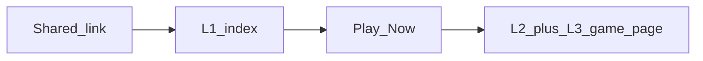

# MiniGameshow — Cursor Roadmap
*Last updated: 2026-04-02*

---

## Prototype baseline & GSD rollback (Mar 2026)

**Pinned baseline commit:** `4048999` — `chore(prototype): baseline penguin game + HUD at 25d5d2c (stable layout)`.

**What we did:** The playable files [`prototypes/penguin-game.html`](prototypes/penguin-game.html), [`prototypes/hud.js`](prototypes/hud.js), and [`prototypes/hud.css`](prototypes/hud.css) were reset to match the tree at git commit **`25d5d2c`** (“fix viewport meta, controls anchor, and rotate-nudge timing”). That snapshot predates a large follow-up change set on those same files. The version you see on a local test server (`npx serve prototypes`) after pulling this commit is the **layout contract**: do not regress desktop or phone playability when re-adding features.

**What “the refactor” was (no second *r*):** In git history, commit **`c7f62f3`** is titled *“Refactor HUD and penguin-game styles; update branding and layout”*. In plain terms, a **refactor** is supposed to reorganize code (structure, CSS, markup) without changing game rules—but that batch (and later commits on top of it) **heavily reworked layout and shell styling**. Combined with a separate **uncommitted desktop resize experiment** (centering/scaling + `fixed` controls), the game became hard to use on desktop. Those changes were **not** the new baseline; we intentionally stepped back to **`25d5d2c`**-era game + HUD sources.

**Still in the repo but not in the baseline game file:** Items built in GSD / later `main` on the rolled-back files—e.g. deeper First Play / post-run overlay work, practice-mode chrome in the game page, welcome **sticker** asset wiring, PWA/font hooks inside the game HTML—need to be **re-added in small steps** after planning, with **layout-only changes isolated** (one reviewable change-set, tested on wide + narrow viewports) so we do not repeat the breakage. **Exception:** home-shell **`?autostart=1`** is wired again on the baseline game (skips title overlay when present in the URL).

**Supabase / migrations:** Phase 2 DB and server behavior may still be ahead of the baseline **overlay**; treat in-game UX as “catch up carefully” where the HTML no longer shows every flow the backend supports.

---

## L1 / L2 / L3 — Entry, competition shell, and arcade game

Three layers — use these names in docs and PRs so “game show” is not confused with the canvas mini-game.

| Layer | Role | Primary URLs / files | Answers for the player |
|-------|------|----------------------|-------------------------|
| **L1 — Entry / show front door** | First paint from a shared link; weekly promise; one obvious CTA | [`prototypes/index.html`](prototypes/index.html) (served as `/` on Vercel) | “What is this, what’s this week, why should I tap?” |
| **L2 — Competition shell** | Identity, attempts, event context, menus, auth entry | [`prototypes/hud.js`](prototypes/hud.js) + title/post-run overlay chrome in [`prototypes/penguin-game.html`](prototypes/penguin-game.html) | “Who am I, can I score, how many tries, leaderboard?” |
| **L3 — Arcade instance** | Canvas, input, run loop, score submission | Canvas + game loop in [`prototypes/penguin-game.html`](prototypes/penguin-game.html) | “What happened this run?” |

**One-line summary:** The **game show** brand moment for cold traffic is **L1**; **L2** is the operating layer once you’re in the app; **L3** is the interchangeable mini-game (Pengu Fisher today, another title later).

**User flow (social or direct link):**



- **L1 → L2/L3:** Play Now goes to `/penguin-game.html?autostart=1` so the title overlay can be skipped for a faster path; opening `/penguin-game.html` without the param still shows the title / First Play card.
- **L1 styling** is owned by [`prototypes/index.html`](prototypes/index.html) only until we extract shared design tokens (optional later).

The **L2 contract is reused every week**; **L3 swaps** while Supabase events, attempts, and leaderboard stay the same.

**Where it lives today:**

| Layer | Where |
|-------|--------|
| L1 | [`prototypes/index.html`](prototypes/index.html) |
| L2 | [`prototypes/hud.js`](prototypes/hud.js), [`prototypes/hud.css`](prototypes/hud.css), overlay / menu markup in [`prototypes/penguin-game.html`](prototypes/penguin-game.html) |
| L3 | Canvas + loop in [`prototypes/penguin-game.html`](prototypes/penguin-game.html) |

### Target architecture — Pattern B (L2 host) + thin L3 modules

**Choice:** Use **Pattern B** as the **primary player route**: one **L2 host page** loads the correct **L3** for the active week (from Supabase / `weeks`), instead of maintaining a separate full HTML page per game that each duplicates the shell.

**Pattern A still applies inside Pattern B:** each title is a **thin arcade bundle** (one ES module or script under e.g. [`prototypes/games/`](prototypes/games/)) that mounts into a single DOM sink (e.g. `#game-mount`) and implements a small **L3 contract**—no duplicated leaderboard, auth, or title/post-run chrome.

**Why this fits miniGameshow:** Phase 3 expects an admin-selected game per event; L1 “Play” should not hard-code `/penguin-game.html` forever. One URL (e.g. [`prototypes/play.html`](prototypes/play.html) served as `/play.html`) keeps **vanilla + static Vercel** deployment and avoids N copies of [`hud.js`](prototypes/hud.js) wiring.

**L3 contract (sketch — refine when implementing):**

| Responsibility | Owner |
|----------------|--------|
| Canvas, input, run loop, local run state | L3 module |
| Mount/unmount, resize notifications from shell | L3 exposes e.g. `mount(el)`, `destroy()`, optional `onResize({ width, height, scale })` |
| Score submission payload shape, attempts, auth session | L2 orchestrates; L3 signals `gameOver(summary)` or similar |

**Stage sizing (mixed aspects, desktop vs phone):** L2 owns the **`#game-mount` rectangle** (after HUD/controls). Each L3 declares its **native design size or aspect** (e.g. Pengu today is landscape 2:1). **Never non-uniform stretch**—use one scale `min(availW/nativeW, availH/nativeH)`, **center** in the mount (letterbox or pillarbox). Widescreen and future portrait titles use the **same policy**; only which edges get bars changes. **Desktop:** game draws inside that framed stage (bars are OK), not stretched to the full viewport. **Game 01** stays landscape-native unless a future product decision rebuilds it for portrait-primary.

**Target flow (after migration):**


**Legacy / deep links:** Keep [`prototypes/penguin-game.html`](prototypes/penguin-game.html) as a **stub** after migration: redirect or load the same host with `?game=pengu` (and preserve `autostart`, etc.) so old shares keep working.

**Phased migration (do in order; one PR per phase where possible):**

1. **Scaffold** — Add [`prototypes/play.html`](prototypes/play.html) (or agreed name) + empty `#game-mount`. L3 contract draft: [`prototypes/games/README.md`](prototypes/games/README.md). No behavior change to [`penguin-game.html`](prototypes/penguin-game.html) yet *or* play page is hidden behind a flag until step 2.
2. **Extract L2** — Move shared shell markup (HUD roots, overlay/menu containers, global styles that are not canvas-specific) from [`penguin-game.html`](prototypes/penguin-game.html) into the host page + a small [`prototypes/gameshow-shell.js`](prototypes/gameshow-shell.js) (name TBD) that owns `GameshowHud.init`, menu panel, and overlay chrome. **Do not** change `resizeCanvas` math in the same PR as unrelated features.
3. **Extract Pengu L3** — Move the canvas game loop and game-only helpers into [`prototypes/games/pengu.js`](prototypes/games/pengu.js) (ES module); host loads it and calls `mount(#game-mount)`. [`penguin-game.html`](prototypes/penguin-game.html) either redirects to the host or becomes a one-line loader.
4. **Week-driven slug** — After [`fetchActiveWeek()`](prototypes/penguin-game.html) (or equivalent) returns the live game slug, host uses `import(\`./games/${slug}.js\`)` (with **fallback UI** if the bundle 404s or throws). Point L1 Play to `/play.html?autostart=1` (and add a [`vercel.json`](vercel.json) rewrite if you want a prettier path later).
5. **Legacy URLs** — Implement redirect stub for [`penguin-game.html`](prototypes/penguin-game.html) → host + `game=pengu`.

**Explicit non-goals for early phases:** No new framework; no bundler required if all `games/*.js` are static files and `import()` paths are literal enough for the browser. If dynamic `import()` with a variable slug is awkward for caching, use a small **registry** object in the host that maps slug → module URL.

---

## What This Product Is

A mobile-first web game show. Players tap a link, play a simple arcade game (5 attempts/day), and compete for a real weekly prize. No app install. A live Sunday stream crowns the weekly champion.

**The core loop:**
- Monday: new game drops, link goes live, social posts go out
- Tue–Sat: players get 5 attempts/day, leaderboard updates live
- Saturday midnight: scoring closes (enforced server-side)
- Sunday: live stream crowns champion, new game goes live immediately after

**The design rules that never change:**
- 5 attempts per day is a feature, not a restriction
- Zero friction — tap link, playing within 10 seconds, no install
- Never pay-to-win, never stressful, never dark
- Phone first — design starts at 375px width
- Vanilla JS only — no framework, no build step

---

## The Codebase Right Now

```
prototypes/penguin-game.html     ← the entire game (~2,900 lines at baseline 4048999, single file)
prototypes/hud.js                ← the top bar HUD (prize, countdown, rank, avatar, menu)
prototypes/hud.css               ← HUD styles
prototypes/admin.html            ← operator admin panel (create/manage events)
prototypes/supabase-config.js    ← your Supabase URL + anon key (gitignored, not in repo)
supabase/schema.sql              ← full database schema
supabase/migrations/             ← migration files applied to Supabase
prototypes/assets/               ← sprites, icons, sticker images
prototypes/games/README.md       ← L3 arcade module contract (draft); `*.js` games land here
GAME_BIBLE.md                    ← full creative/design reference (characters, games, tone)
```

**Supabase tables:**
- `profiles` — user accounts: id, username, display_name, is_18_plus, is_admin, is_banned
- `weeks` — competition events: name, prize, start/end times, game selection
- `runs` — every score submitted with event reference, day seed, gameplay data
- `daily_attempts` — enforces the 5-attempts-per-day limit per user per seed
- `leaderboard` — ranked scores view

---

## What's Already Built

### ✅ Phase 1 — Phone Shell & PWA (complete)
- Game renders full-screen on mobile with no horizontal scroll
- JUMP and CAST thumb buttons sized for thumbs (44×44px minimum)
- Safe-area insets for notched phones (iPhone X+)
- PWA manifest — installable from browser, no app store
- Supabase JS pinned to specific CDN version

### ✅ Phase 2 — Auth & Player Profiles (complete on backend / HUD track; game overlay may lag baseline)
- Signup with display name + age checkbox (18+)
- Session persists across browser refreshes
- Forgot password / email reset flow
- Account tab: avatar circle, display name, age badge, sign out
- Under-18 users get `playMode='practice'` with amber indicator — scores save but stay on under-18 leaderboard only
- Leaderboard shows display name (not email)
- DB migration: `profiles` table has `display_name` and `is_18_plus` columns

**Baseline note:** After rollback commit `4048999`, the **in-game** title/post-run surfaces may not yet expose every Phase 2 UX that existed on pre-baseline `main`. Reconcile with the **Prototype baseline** section above when planning re-adds.

---

## 🔧 Repair List (Do These First)

These are known issues that need fixing or verification before moving forward:

### 1. Desktop / phone layout — keep baseline sacred
**Files:** `prototypes/penguin-game.html`, `prototypes/hud.css` (anything touching `#canvas-wrap`, `#controls`, `#top-bar`, `resizeCanvas`, or shell letterboxing)
**Status:** **Baseline `4048999` is the working reference** (verified on local `serve`). Prior breakage came from post-`25d5d2c` layout refactors plus an uncommitted resize experiment. Any future layout tweak should be **its own small change**, tested wide + narrow, before stacking features.

### 2. Welcome sticker image
**File:** `prototypes/penguin-game.html` (when reintroduced)
**Status:** **Not in baseline `4048999`.** Earlier `main` used `assets/PLAY-TO-WIN_1.png` (200×200) with careful card padding so the sticker could sit half above the card. When adding it back, use the small asset—not the 2752×1536 `PLAY-TO-WIN.png`—and avoid mixing sticker work with canvas/control scaling in the same pass.

### 3. Auth flow — end-to-end test needed
**Problem:** The entire auth system (signup, signin, forgot password, age gating, account tab) was built by AI agents and never manually tested end-to-end.
**What to test:**
- Sign up with display name + email + password + age checkbox checked → account created, display name on leaderboard, shows "Competitor" badge
- Sign up with age checkbox UNCHECKED → account created, practice mode amber banner appears, account tab shows "Practice Mode" badge
- Sign out → practice notice hides, state resets to guest
- Sign in on a different browser → session restores
- Forgot password → reset email arrives, link opens new-password form, password updates successfully
- Leaderboard shows display name not email

### 4. Supabase migration — run on your project
**File:** `supabase/migrations/20260403_add_display_name_is_18_plus.sql`
**Problem:** The migration file exists locally but may not have been applied to your Supabase project yet.
**Fix:** Run it via Supabase CLI (`supabase db push`) or paste it in the SQL editor in the Supabase dashboard.

### 5. Supabase Auth — Site URL and redirect allow list
**Problem:** Signup confirmation emails can contain **`http://localhost:…`** links. Mobile Safari cannot open that host, so the user never confirms. **Sign-in then fails** with “Invalid login credentials” while **Confirm email** is still required for that account.
**Fix (dashboard):** Supabase → **Authentication** → **URL Configuration**: set **Site URL** to your real app origin (e.g. `https://<project>.vercel.app`). Under **Redirect URLs**, add that origin and paths you use (e.g. `https://<project>.vercel.app/penguin-game.html`, or a pattern like `https://*.vercel.app/**` if your plan allows). Keep a separate localhost entry for local dev if needed.
**Fix (app):** Sign-up uses `emailRedirectTo` = current page URL so production signups get production links (see `signUp` in [`prototypes/penguin-game.html`](prototypes/penguin-game.html)).
**Stuck users:** In Supabase → **Authentication** → **Users**, either delete the test user and sign up again after fixing URLs, or manually confirm the email for that user.

---

## What's Next — Remaining Phases

### Phase 3 — Event System & Admin Controls
**Goal:** An operator (you) can create and manage a competition event. Everything in the game responds to the active event.

**What to build:**
1. **Event CRUD in admin panel** — create/edit/delete events with: game selection, event name, optional prize text, start datetime, end datetime, test/internal flag. Admin panel must be behind `is_admin = true` check.
2. **Server-side cutoff enforcement** — a Postgres trigger rejects any run inserted after `weeks.ends_at`. Player sees "Scoring closed" message.
3. **One active event at a time** — DB constraint prevents two overlapping active events.
4. **HUD event awareness** — HUD shows active event name, prize, and countdown to Saturday cutoff. Correct state when no event is active.
5. **Post-event admin view** — frozen leaderboard after event ends with winner (#1 on 18+ board) highlighted. Manual "new event live" trigger button for post-show.
6. **Player ban controls** — admin can ban a player; their score submissions are blocked at DB level.

**Done when:** Admin can create an event, game shows the prize and countdown, scoring closes automatically at the deadline, and admin can see the winner.

---

### Phase 4 — Gameplay Polish, Leaderboard & Security
**Goal:** The full competitive loop is production-ready and hardened.

**What to build:**
1. **Attempt dots accuracy** — HUD attempt dots always match `daily_attempts` in DB, including after page refresh and next-day reset.
2. **Game-over screen** — shows run score, personal best, remaining attempts today, current leaderboard rank. All within 2 seconds of run ending.
3. **Leaderboard panel** — two views: 18+ competitors and under-18 practice. Fetch on panel open. Freeze display after event cutoff.
4. **Score validation** — each run submission includes a gameplay hash (input count, session duration, day seed match). Runs that don't pass are flagged `is_validated = false` in the DB. Not blocked — flagged for review.
5. **RLS verification** — confirm a score submitted without a valid auth JWT is rejected by Supabase row-level security.
6. **Banned player enforcement** — `is_banned = true` on profiles table blocks score inserts at DB level.

**Done when:** Attempt dots are always right, the game-over screen shows meaningful data, leaderboard has age-separated views, and basic score manipulation is flagged.

---

### Phase 5 — Score Card Sharing
**Goal:** After any run, players can share a score card that drives new players into the game with one tap.

**What to build:**
1. **Score card** — shareable image (Canvas export or styled DOM snapshot) showing: score, current rank, event name, game character. Triggered via Web Share API on mobile, fallback to clipboard copy on desktop.
2. **Open Graph tags** — `og:title`, `og:description`, `og:image` on the game page so the shared link shows a proper preview in iMessage, Twitter, Slack, etc.

**Done when:** The Share button appears after every run, the card looks good, and pasting the link anywhere shows a proper preview.

---

### Phase 6 — Fish Stack (Game 02)
**Goal:** Fish Stack is fully playable as a selectable competition game.

**Note from Game Bible:** A prototype may already exist. Check the repo for a `fish-stack.html` or similar before rebuilding.

**What to build:**
1. **Fish Stack core game** — stacking mechanic, 7 fish piece types (Salmon, Eel, Pufferfish, Herring, Tuna, Cod, Mackerel), Babs the Walrus reacting live with 5 emotional states and 30+ voice lines. Must be legible in under 10 seconds with no tutorial.
2. **Supabase integration** — score submission with gameplay hash, daily attempts, event linkage. Register `fish-stack` slug in `games` table.
3. **Admin game selection** — admin can pick Fish Stack as the event game. Leaderboard, attempts, and game-over screen all work identically to Pengu Fisher.

**Done when:** Fish Stack is playable at its own URL, fully wired to the competition system, and Babs is present with her personality intact.

---

## Characters (from Game Bible)

| Character | Role | In Game 01 | In Game 02 |
|-----------|------|-----------|-----------|
| **The Penguin** (name TBD) | Player character | Side-scroller protagonist | — |
| **Babs** (Walrus) | Elder shopkeeper, grumpy, secretly supportive | Breathing obstacle — slip under her | Reacts live to your stack, 30+ voice lines |
| **Polar Bear** (name TBD) | Charming rival | Variable speed obstacle | — |
| **Seal** (name TBD) | Comic relief, chaos energy | Lunging obstacle with telegraph warning | — |
| **Narwhal** (name TBD) | Mysterious, ancient, rarely seen | Appears during frenzy/bonus events | Deep Dive (Game 03) |

*Names are TBD — a design/naming session is planned before public launch.*

---

## Known Future Work (Not Scheduled Yet)

- **Game 03: Deep Dive** — Narwhal, underwater world, breath mechanic (fully designed in Game Bible)
- **Character voiceover** — Babs' lines get actual voice acting
- **Geo/age restriction framework** — structure for legal compliance in different regions
- **Winner announcement flow** — post-show UX for the champion reveal
- **Score card OG image generation** — server-side image for richer social previews
- **Naming/design session** — finalize character names before public launch

---

## How to Use This Doc in Cursor

Paste the relevant section at the start of your Cursor session. Read **Prototype baseline & GSD rollback** first so agents do not “restore” pre-baseline layout refactors by accident. Use the **Repair List** for verification and migrations; plan **incremental re-adds** from GSD against baseline `4048999`. After repairs are done and tested on a real phone + a wide desktop browser, move to Phase 3.

For creative/design questions (character behavior, tone, game mechanics) → refer to `GAME_BIBLE.md`.
For code structure questions → **L1** is [`prototypes/index.html`](prototypes/index.html); **L2** and **L3** live in [`prototypes/penguin-game.html`](prototypes/penguin-game.html) plus [`prototypes/hud.js`](prototypes/hud.js) / [`prototypes/hud.css`](prototypes/hud.css).
