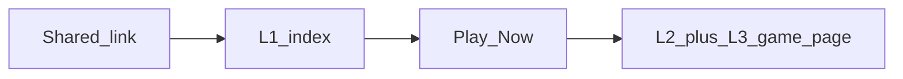
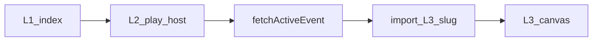

# MiniGameshow — Cursor Roadmap
*Last updated: 2026-04-10*

---

## Shipped 2026-04-10 — Run-based competition leaderboard + RLS

**Commit:** `a709b9e` on `main`.

| Area | Change |
|------|--------|
| **DB** | Migration [`supabase/migrations/20260411120000_runs_public_read_and_daily_attempts_admin.sql`](supabase/migrations/20260411120000_runs_public_read_and_daily_attempts_admin.sql): public `SELECT` on **`runs`** (`anon` + `authenticated`); admin `SELECT` on all **`daily_attempts`**. [`supabase/schema.sql`](supabase/schema.sql) updated to match. |
| **Admin** | [`prototypes/admin.html`](prototypes/admin.html): competition leaderboard from **`runs`** (top N runs, tie-break `created_at`); winner banner from top run; silent tbody refresh on poll/Realtime; CSV includes run time in competition mode. |
| **Game** | [`prototypes/penguin-game.html`](prototypes/penguin-game.html): in-shell leaderboard + rank / top score derived from **`runs`** (rank = global run order for the player’s best-placed run). |

**Follow-up (not blocking):** Admin “Players” stat in [`loadLiveStats`](prototypes/admin.html) still counts **`leaderboard`** rows; consider **`COUNT(DISTINCT user_id)` on `runs`** for the focused event so the hero stat matches run-based semantics.

---

## Start here next session (legal compliance)

When you pick up **legal / sweepstakes / consent** work:

1. Read **[`LEGAL_IMPLEMENTATION_BRIEF.md`](LEGAL_IMPLEMENTATION_BRIEF.md)** end to end (tiers, pages, DB, flows, cookie banner, copy placement).
2. Read **`GAME_BIBLE.md` → Section 8 → “Legal, consent & sweepstakes”** for product-aligned framing (Tier 1 vs Tier 2, silent Arcade routing for under-18).
3. **Before applying DB changes:** confirm with counsel; then apply
   [`supabase/migrations/20260405120000_legal_consent_and_audit_tables.sql`](supabase/migrations/20260405120000_legal_consent_and_audit_tables.sql)
   to the Supabase project (CLI or SQL editor). Until then the file is **spec only**.
4. **Build order (suggested):** (a) static `/legal/*` pages + `vercel.json` rewrites,
   (b) L1 + HUD “no purchase necessary” line, (c) sign-up TOS/Privacy checkbox +
   `user_legal_consent` row for `tos_general`, (d) cookie banner gating analytics,
   (e) Competition-entry modal: DOB + rules + checkboxes + two consent rows,
   (f) server-side enforcement on Competition `runs` insert, (g) admin
   disqualification logging UI → `disqualifications`.

Nothing in this list is required for day-to-day gameplay prototyping until you
are preparing for **prize-eligible production**.

---

## Prototype baseline & GSD rollback (Mar 2026)

**Pinned baseline commit:** `4048999` — `chore(prototype): baseline penguin game + HUD at 25d5d2c (stable layout)`.

**What we did:** The playable files [`prototypes/penguin-game.html`](prototypes/penguin-game.html), [`prototypes/hud.js`](prototypes/hud.js), and [`prototypes/hud.css`](prototypes/hud.css) were reset to match the tree at git commit **`25d5d2c`** (“fix viewport meta, controls anchor, and rotate-nudge timing”). That snapshot predates a large follow-up change set on those same files. The version you see on a local test server (`npx serve prototypes`) after pulling this commit is the **layout contract**: do not regress desktop or phone playability when re-adding features.

**What “the refactor” was (no second *r*):** In git history, commit **`c7f62f3`** is titled *“Refactor HUD and penguin-game styles; update branding and layout”*. In plain terms, a **refactor** is supposed to reorganize code (structure, CSS, markup) without changing game rules—but that batch (and later commits on top of it) **heavily reworked layout and shell styling**. Combined with a separate **uncommitted desktop resize experiment** (centering/scaling + `fixed` controls), the game became hard to use on desktop. Those changes were **not** the new baseline; we intentionally stepped back to **`25d5d2c`**-era game + HUD sources.

**Still in the repo but not in the baseline game file:** Items built in GSD / later `main` on the rolled-back files—e.g. deeper First Play / post-run overlay work, practice-mode chrome in the game page, welcome **sticker** asset wiring, PWA/font hooks inside the game HTML—need to be **re-added in small steps** after planning, with **layout-only changes isolated** (one reviewable change-set, tested on wide + narrow viewports) so we do not repeat the breakage. **Exception:** home-shell **`?autostart=1`** is wired again on the baseline game (skips title overlay when present in the URL).

**Supabase / migrations:** Phase 2 DB and server behavior may still be ahead of the baseline **overlay**; treat in-game UX as “catch up carefully” where the HTML no longer shows every flow the backend supports.

---

## L1 / L2 / L3 — Entry, competition shell, and arcade game

Three layers — use these names in docs and PRs so “game show” is not confused with the canvas mini-game.

| Layer | Role | Primary URLs / files | Answers for the player |
|-------|------|----------------------|-------------------------|
| **L1 — Entry / show front door** | First paint from a shared link; weekly promise; one obvious CTA | [`prototypes/index.html`](prototypes/index.html) (served as `/` on Vercel) | “What is this, what’s this week, why should I tap?” |
| **L2 — Competition shell** | Identity, attempts, event context, menus, auth entry | [`prototypes/hud.js`](prototypes/hud.js) + title/post-run overlay chrome in [`prototypes/penguin-game.html`](prototypes/penguin-game.html) | “Who am I, can I score, how many tries, leaderboard?” |
| **L3 — Arcade instance** | Canvas, input, run loop, score submission | Canvas + game loop in [`prototypes/penguin-game.html`](prototypes/penguin-game.html) | “What happened this run?” |

**One-line summary:** The **game show** brand moment for cold traffic is **L1**; **L2** is the operating layer once you’re in the app; **L3** is the interchangeable mini-game (Pengu Fisher today, another title later).

**User flow (social or direct link):**



- **L1 → L2/L3:** Play Now goes to `/penguin-game.html?autostart=1` so the title overlay can be skipped for a faster path; opening `/penguin-game.html` without the param still shows the title / First Play card.
- **L1 styling** is owned by [`prototypes/index.html`](prototypes/index.html) only until we extract shared design tokens (optional later).

The **L2 contract is reused every week**; **L3 swaps** while Supabase events, attempts, and leaderboard stay the same.

**Where it lives today:**

| Layer | Where |
|-------|--------|
| L1 | [`prototypes/index.html`](prototypes/index.html) |
| L2 | [`prototypes/hud.js`](prototypes/hud.js), [`prototypes/hud.css`](prototypes/hud.css), overlay / menu markup in [`prototypes/penguin-game.html`](prototypes/penguin-game.html) |
| L3 | Canvas + loop in [`prototypes/penguin-game.html`](prototypes/penguin-game.html) |

### Target architecture — Pattern B (L2 host) + thin L3 modules

**Choice:** Use **Pattern B** as the **primary player route**: one **L2 host page** loads the correct **L3** for the active event (from Supabase / `events`), instead of maintaining a separate full HTML page per game that each duplicates the shell.

**Pattern A still applies inside Pattern B:** each title is a **thin arcade bundle** (one ES module or script under e.g. [`prototypes/games/`](prototypes/games/)) that mounts into a single DOM sink (e.g. `#game-mount`) and implements a small **L3 contract**—no duplicated leaderboard, auth, or title/post-run chrome.

**Why this fits miniGameshow:** Phase 3 expects an admin-selected game per event; L1 “Play” should not hard-code `/penguin-game.html` forever. One URL (e.g. [`prototypes/play.html`](prototypes/play.html) served as `/play.html`) keeps **vanilla + static Vercel** deployment and avoids N copies of [`hud.js`](prototypes/hud.js) wiring.

**L3 contract (sketch — refine when implementing):**

| Responsibility | Owner |
|----------------|--------|
| Canvas, input, run loop, local run state | L3 module |
| Mount/unmount, resize notifications from shell | L3 exposes e.g. `mount(el)`, `destroy()`, optional `onResize({ width, height, scale })` |
| Score submission payload shape, attempts, auth session | L2 orchestrates; L3 signals `gameOver(summary)` or similar |

**Stage sizing (mixed aspects, desktop vs phone):** L2 owns the **`#game-mount` rectangle** (after HUD/controls). Each L3 declares its **native design size or aspect** (e.g. Pengu today is landscape 2:1). **Never non-uniform stretch**—use one scale `min(availW/nativeW, availH/nativeH)`, **center** in the mount (letterbox or pillarbox). Widescreen and future portrait titles use the **same policy**; only which edges get bars changes. **Desktop:** game draws inside that framed stage (bars are OK), not stretched to the full viewport. **Game 01** stays landscape-native unless a future product decision rebuilds it for portrait-primary.

**Target flow (after migration):**



**Legacy / deep links:** Keep [`prototypes/penguin-game.html`](prototypes/penguin-game.html) as a **stub** after migration: redirect or load the same host with `?game=pengu` (and preserve `autostart`, etc.) so old shares keep working.

**Phased migration (do in order; one PR per phase where possible):**

1. **Scaffold** — Add [`prototypes/play.html`](prototypes/play.html) (or agreed name) + empty `#game-mount`. L3 contract draft: [`prototypes/games/README.md`](prototypes/games/README.md). No behavior change to [`penguin-game.html`](prototypes/penguin-game.html) yet *or* play page is hidden behind a flag until step 2.
2. **Extract L2** — Move shared shell markup (HUD roots, overlay/menu containers, global styles that are not canvas-specific) from [`penguin-game.html`](prototypes/penguin-game.html) into the host page + a small [`prototypes/gameshow-shell.js`](prototypes/gameshow-shell.js) (name TBD) that owns `GameshowHud.init`, menu panel, and overlay chrome. **Do not** change `resizeCanvas` math in the same PR as unrelated features.
3. **Extract Pengu L3** — Move the canvas game loop and game-only helpers into [`prototypes/games/pengu.js`](prototypes/games/pengu.js) (ES module); host loads it and calls `mount(#game-mount)`. [`penguin-game.html`](prototypes/penguin-game.html) either redirects to the host or becomes a one-line loader.
4. **Week-driven slug** — After [`fetchActiveEvent()`](prototypes/penguin-game.html) (or equivalent) returns the live game slug, host uses `import(\`./games/${slug}.js\`)` (with **fallback UI** if the bundle 404s or throws). Point L1 Play to `/play.html?autostart=1` (and add a [`vercel.json`](vercel.json) rewrite if you want a prettier path later).
5. **Legacy URLs** — Implement redirect stub for [`penguin-game.html`](prototypes/penguin-game.html) → host + `game=pengu`.

**Explicit non-goals for early phases:** No new framework; no bundler required if all `games/*.js` are static files and `import()` paths are literal enough for the browser. If dynamic `import()` with a variable slug is awkward for caching, use a small **registry** object in the host that maps slug → module URL.

---

## What This Product Is

A mobile-first web game show. Players tap a link, play a simple arcade game, and
compete for a real weekly prize. No app install. A live Sunday stream crowns the
weekly champion. Competition players get 5 attempts per day on a shared daily
seed. Arcade is unlimited with a random seed every run — anyone can play
as much as they want, no prize pressure.

**The core loop:**
- Monday: new game drops, link goes live, social posts go out
- Tue–Sat: players get 5 attempts/day, leaderboard updates live
- Saturday midnight: scoring closes (enforced server-side)
- Sunday: live stream crowns champion, new game goes live immediately after

**The design rules that never change:**
- 5 Competition attempts per day is a feature, not a restriction — Arcade is always unlimited
- Zero friction — tap link, playing within 10 seconds, no install
- Never pay-to-win, never stressful, never dark
- Phone first — design starts at 375px width
- Vanilla JS only — no framework, no build step

---

## The Codebase Right Now

```
prototypes/index.html            ← L1 landing; links /manifest.json
prototypes/manifest.json         ← Web App Manifest (icons, theme); no service worker yet
prototypes/penguin-game.html     ← L2/L3: shell + Pengu Fisher (~3k+ lines; layout baseline 4048999)
prototypes/hud.js                ← Zone 1 HUD (prize, countdown, rank, avatar, menu)
prototypes/hud.css               ← HUD styles
prototypes/admin.html            ← operator UI: light-theme sidebar (live dashboard / new week / user admin); Edge Functions + RPCs
prototypes/supabase-config.js    ← Supabase URL + anon key (+ functions URL when set); gitignored
supabase/schema.sql              ← full database schema (reference)
supabase/migrations/             ← ordered migrations (see list below)
supabase/functions/              ← Edge: admin-list-users, admin-auth-create-user, admin-auth-delete-user
scripts/deploy-supabase-functions.sh   ← used by npm run deploy:functions
prototypes/assets/               ← sprites, icons, PWA icons
prototypes/games/README.md       ← L3 module contract (draft)
GAME_BIBLE.md                    ← creative/design reference
LEGAL_IMPLEMENTATION_BRIEF.md      ← legal/compliance engineering checklist (see “Start here next session”)
vercel.json                      ← outputDirectory prototypes/; / → index.html
package.json                     ← build (supabase-config) + deploy:functions
```

**Supabase tables (high level):**
- `profiles` — id (auth user), username, display_name, is_18_plus, is_admin, is_banned
- `events` — competition windows: game_id, starts_at, ends_at, prize fields, show_at, show_url, seed, …
- `runs` — score rows: user_id, event_id, day_seed, attempt_num, replay_payload, …
- `daily_attempts` — 5 attempts per user per day_seed (enforced in `before_run_insert`)
- `leaderboard` — best score per user per event (+ rank refresh); **public competition board UI** reads ordered **`runs`** (see **Shipped 2026-04-10**)

---

## What's Already Built

### ✅ Phase 1 — Phone shell (complete); PWA (partial)
- Game renders full-screen on mobile with no horizontal scroll
- JUMP and CAST thumb buttons sized for thumbs (44×44px minimum)
- Safe-area insets for notched phones (iPhone X+)
- **Manifest:** `prototypes/manifest.json` exists and is linked from **`index.html` (L1)** only — “Add to Home Screen” works from the landing page path; **`penguin-game.html` does not reference the manifest**
- **Service worker:** not implemented — no offline cache
- Supabase JS loaded from CDN in the HTML pages

### ⚠ Phase 2 — Auth & profiles (mixed: DB ready, overlay minimal today)
- **Implemented today:** Email + password sign-in / sign-up in the title overlay; OAuth (Google / Apple) and phone OTP exist in markup but are **CSS-hidden** (see Known Future Work). Session persists across refreshes. Shell **Account** tab + HUD use **`profiles.username`** (fallback email prefix); in-game leaderboard join uses **`profiles.username`**, not `display_name`.
- **DB / migrations:** `display_name` and `is_18_plus` on `profiles` (`20260403_add_display_name_is_18_plus.sql`); `handle_new_user` reads signup metadata when present.
- **Not in current `penguin-game.html` overlay:** Collecting display name or age at sign-up; `playMode` values are **`guest` / `competing` / `freeplay` only** (no under-18 “practice” mode or age-gated leaderboard in the client).
- **Repair / catch-up:** Reconcile overlay UX with backend when you want Phase-2-complete behavior — see Repair List §3.

**Baseline note:** Commit **`4048999`** is still the **layout** reference for `penguin-game.html` + HUD; feature work should stay in small, tested steps (see **Prototype baseline** above).

---

## 🔧 Repair List (Do These First)

These are known issues that need fixing or verification before moving forward:

### 1. Desktop / phone layout — keep baseline sacred
**Files:** `prototypes/penguin-game.html`, `prototypes/hud.css` (anything touching `#canvas-wrap`, `#controls`, `#top-bar`, `resizeCanvas`, or shell letterboxing)
**Status:** **Baseline `4048999` is the working reference** (verified on local `serve`). Prior breakage came from post-`25d5d2c` layout refactors plus an uncommitted resize experiment. Any future layout tweak should be **its own small change**, tested wide + narrow, before stacking features.

### 2. Welcome sticker image
**File:** `prototypes/penguin-game.html` (when reintroduced)
**Status:** **Not in baseline `4048999`.** Earlier `main` used `assets/PLAY-TO-WIN_1.png` (200×200) with careful card padding so the sticker could sit half above the card. When adding it back, use the small asset—not the 2752×1536 `PLAY-TO-WIN.png`—and avoid mixing sticker work with canvas/control scaling in the same pass.

### 3. Auth flow — end-to-end test needed
**Problem:** Auth was largely agent-built; **current overlay** is email/password (+ hidden OAuth/phone). Display name, age checkbox, and practice mode are **not wired** in `penguin-game.html` today even though the DB supports some of it.
**What to test (as implemented now):**
- Sign up / sign in with email + password; confirm row in `auth.users` and `profiles`
- Sign out → guest / competing / freeplay behavior matches `GAME_BIBLE.md`
- Sign in on a different browser → session restores
- Forgot password → reset flow (if exposed in UI) end-to-end
- Leaderboard lists **`username`** from `profiles` (or “Player”) — not `display_name` until the client uses it

**Future tests (when overlay collects metadata):** display name + `is_18_plus` on signup, practice/competitor modes, age-separated boards — align with migrations and `handle_new_user`.

### 4. ~~Supabase migration — `display_name` / `is_18_plus`~~ ✅ Applied (April 4, 2026)
**File:** `supabase/migrations/20260403_add_display_name_is_18_plus.sql`
**Status:** Applied to live Supabase project. `profiles.display_name` and `profiles.is_18_plus` columns now exist. Admin panel and game client can reference `display_name` safely.

### 5. Supabase Auth — Site URL and redirect allow list
**Problem:** Signup confirmation emails can contain **`http://localhost:…`** links. Mobile Safari cannot open that host, so the user never confirms. **Sign-in then fails** with “Invalid login credentials” while **Confirm email** is still required for that account.
**Fix (dashboard):** Supabase → **Authentication** → **URL Configuration**: set **Site URL** to your real app origin (e.g. `https://<project>.vercel.app`). Under **Redirect URLs**, add that origin and paths you use (e.g. `https://<project>.vercel.app/penguin-game.html`, or a pattern like `https://*.vercel.app/**` if your plan allows). Keep a separate localhost entry for local dev if needed.
**Fix (app):** Sign-up uses `emailRedirectTo` = current page URL so production signups get production links (see `signUp` in [`prototypes/penguin-game.html`](prototypes/penguin-game.html)).
**Stuck users:** In Supabase → **Authentication** → **Users**, either delete the test user and sign up again after fixing URLs, or manually confirm the email for that user.

**Signup “succeeds” but no email and no row:** (1) Check **Authentication → Users** first — `public.profiles` is filled by a DB trigger; if the user never lands in `auth.users`, nothing appears in `profiles`. (2) **Logs → Auth** in the dashboard for send errors. (3) **Custom SMTP is configured** (Supabase Project Settings → Auth → SMTP) — rate limits are not a concern. (4) Confirm **Vercel** `SUPABASE_URL` / `SUPABASE_ANON_KEY` match the project you are inspecting. (5) Ensure migrations that create **`on_auth_user_created`** / `handle_new_user` are applied on that project.

**Resend confirmation email — not yet implemented in UI.** After sign-up, if the
player can't find the confirmation email: the overlay should stay in a "waiting
for confirmation" state with a visible **Resend** button. Use:
```javascript
await supabase.auth.resend({ type: 'signup', email: userEmail })
```
If the player closes the app and tries to sign in, catch `error.code ===
'email_not_confirmed'` and show "Your email isn't confirmed yet — resend
confirmation?" instead of a generic failure. Add "Check your spam folder" as
the first line of post-signup copy.

### 6. Admin: `runs_select_admin` RLS policy ✅ Applied (April 4, 2026)
**File:** `supabase/migrations/20260404_admin_runs_select_policy.sql`
**Problem:** The only SELECT policy on `runs` was `runs_select_own` (`user_id = auth.uid()`). Admins querying `runs` through the anon-key client could only see their own rows — other players' runs were silently filtered out, so the admin flagged-runs card was showing the admin's own test runs instead of real player data.
**Fix:** New policy `runs_select_admin` allows any authenticated user with `profiles.is_admin = true` to SELECT all rows. The two policies OR together: admins see everything, regular users see only their own.
**Status:** Applied to live Supabase project April 4, 2026.

### 7. Admin: password manager triggering on every button click ✅ Fixed (April 4, 2026)
**Root cause:** `showAdminPanel()` was hiding `#auth-gate` with `display:none` but leaving the `<input type="password">` in the DOM. Password managers watch any live password field and fire on nearby clicks.
**Fix:** `showAdminPanel()` now calls `gate.remove()` — the entire auth gate node (including the password input) is removed from the DOM on successful login. `autocomplete="off"` added to the sign-in form as belt-and-suspenders.

### 8. Admin: nav broken on load when already signed in ✅ Fixed (April 4, 2026)
**Root cause:** Boot code called `showAdminPanel()` (which removed `#auth-gate`), then unconditionally tried to attach a submit listener to `#signin-form` (now gone) — the null dereference crashed the boot sequence before sidebar nav listeners were wired.
**Fix:** Signin-form listener is now guarded: `const f = document.getElementById('signin-form'); if(f) f.addEventListener(...)`. `showAuthGate()` similarly guarded against the gate already being gone.

### 9. Admin: flagged runs player names showing "Unknown" ⚠ Partially fixed (April 4, 2026)
**Root cause:** The PostgREST embedded join `profiles(display_name, username)` in `runs` queries was returning null silently — likely a join-resolution issue under the admin JWT context. Combined with the missing `runs_select_admin` policy (§6), the admin could only see their own test runs, which had no `username` set.
**Fix deployed:** Both `loadFlaggedCard` and `loadFlaggedTab` now use a two-step fetch: fetch runs without join, extract unique `user_id`s, then `profiles.select().in('id', uids)` separately, merge into a map. Policy (§6) also applied.
**Status:** Code pushed (`d70e4a8`). Player names not yet confirmed working — user had to leave before verification. If names still show "Unknown" on next session, check that `profiles` rows exist for the flagged users: `SELECT id, username, display_name FROM profiles` in the SQL editor.

---

## What's Next — Remaining Phases

### Phase 2b — Competition / Arcade Mode Separation
**Goal:** The two-mode system (Competition with shared daily seed + Arcade with
random per-run seed) is fully implemented in the DB, backend, and frontend.
This is prerequisite work before Phase 4 leaderboard views can be built correctly.

**What to build:**

1. **DB migration — `runs.mode` column**
   ```sql
   ALTER TABLE runs
     ADD COLUMN mode text NOT NULL DEFAULT 'competition'
       CHECK (mode IN ('competition', 'arcade'));
   ALTER TABLE runs ALTER COLUMN event_id DROP NOT NULL;
   ```
   Backfill existing rows: existing `freeplay` runs (random seed, no `event_id`)
   → `mode = 'arcade'`. Existing `competing` runs → `mode = 'competition'`.

2. **Arcade seed generation** — replace `getDailySeed()` for arcade runs with
   `crypto.getRandomValues()` (returns a random hex string stored in `runs.day_seed`).
   Competition seed remains `YYYYMMDD` date integer unchanged.

3. **Mode switcher UI** — HUD or pre-game screen shows active mode explicitly.
   Competition: shows attempt dots, prize, daily seed indicator. Arcade: shows
   distinct indicator, no attempt counter, "unlimited" copy. Switching is a
   deliberate tap — never accidental. Player must never burn a Competition attempt
   thinking they were in Arcade.

4. **Sign-up form updates** — add display name (pre-filled from arcade name if
   set) and age checkbox ("I confirm I am 18 or older — required to enter the
   competition and win prizes") to the sign-up overlay. Wire `is_18_plus` to route
   scores: checked → Competition + Arcade boards; unchecked → Arcade board only.
   No label or banner shown to the player about age routing.

5. **Arcade name flow** — guest top-10 prompt after each arcade run (every time,
   no localStorage persistence). Name checked live for uniqueness. After third
   re-entry, prompt adds: "You've entered X times — save it permanently →" inline.
   Session-stored name used for that session's arcade board entry only.

6. **Resend confirmation email** — post-signup overlay "waiting for confirmation"
   state with Resend button (`supabase.auth.resend`). `email_not_confirmed` error
   handler on sign-in. See `GAME_BIBLE.md` Section 8 for full spec.

7. **Arcade leaderboard query** — all-time personal best per player across all
   weeks, filtered `WHERE mode = 'arcade'`. Show week tag (e.g. W09) next to
   each score so players know when their best run was.

**Done when:** A signed-in player can clearly switch between Competition and
Arcade, scores land in the correct board, the DB `mode` column is populated
correctly on every insert, and the arcade name loop works for guests.

**See also:** `GAME_BIBLE.md` Section 8 (Competition vs Arcade) and Section 8
(Sign-up Flow) for full product spec and copy direction.

---

### Phase 3 — Event System & Admin Controls
**Goal:** An operator (you) can create and manage a competition event. Everything in the game responds to the active event.

**Already in repo (partial Phase 3):**
1. **`prototypes/admin.html`** — `profiles.is_admin` gate; **events** list + create/update (fields include prize copy, `show_at`, `show_url`, window dates, seed, game id). **Overlap warning** when two events for the same game have intersecting `[starts_at, ends_at]` (UI only — not a DB constraint).
2. **Users card** — Supabase Edge Functions **`admin-list-users`**, **`admin-auth-create-user`**, **`admin-auth-delete-user`** (JWT + admin guard); RPCs for **`admin_set_profile_flags`** (ban/admin), clearing competition data, etc. (`20260330120000_admin_user_mgmt.sql`). Deploy with **`npm run deploy:functions`**.
3. **Ban enforcement** — `before_run_insert` raises if `profiles.is_banned` for the runner.
4. **HUD / submit “active event”** — `fetchActiveEvent` and score submit query `events` with `starts_at ≤ now ≤ ends_at` (client-side); ties broken by latest `starts_at`. No Postgres trigger yet that rejects inserts when the event is closed or mismatched.

**Still to build:**
1. **Server-side cutoff on insert** — Postgres (or Edge submit path) validates `event_id` against `now` and `ends_at` / `starts_at` so clients cannot target arbitrary events.
2. **DB constraint for non-overlapping windows** (optional product decision) — currently **warning-only** in admin.
3. **Post-event admin view** — frozen leaderboard, winner highlight, “new event live” trigger (not in `admin.html` today).
4. **Full schedule copy vs DB** — HUD time states remain client rules; “Saturday local midnight” server enforcement is still product/DB work (see `GAME_BIBLE.md` §2 vs implementation).

**Done when:** Admin can create an event, game shows the prize and countdown, **scoring is enforced at the database** at the deadline, and admin can see the winner without ad-hoc SQL.

---

### Phase 4 — Gameplay Polish, Leaderboard & Security
**Goal:** The full competitive loop is production-ready and hardened.

**What to build:**
1. **Attempt dots accuracy** — HUD attempt dots always match `daily_attempts` in DB, including after page refresh and next-day reset.
2. **Game-over screen** — shows run score, personal best, remaining attempts today, current leaderboard rank. All within 2 seconds of run ending.
3. **Leaderboard panel** — two views: **Competition** (weekly, shared seed,
   18+ verified, prize eligible) and **Arcade** (all-time personal best, all
   players, random seed per run, never resets). Fetch on panel open. Competition
   view freezes after Saturday cutoff. Arcade view always live. See Section 8 of
   `GAME_BIBLE.md` for full mode separation spec.
4. **Score validation** — each run submission includes a gameplay hash (input count, session duration, day seed match). Runs that don't pass are flagged `is_validated = false` in the DB. Not blocked — flagged for review.
5. **RLS verification** — confirm a score submitted without a valid auth JWT is rejected by Supabase row-level security.
6. **Banned player enforcement** — **`is_banned`** already blocks inserts in **`before_run_insert`**; keep RLS/JWT verification aligned when adding new write paths.

**Done when:** Attempt dots are always right, the game-over screen shows meaningful data, leaderboard has age-separated views, and basic score manipulation is flagged.

---

### Phase 5 — Score Card Sharing
**Goal:** After any run, players can share a score card that drives new players into the game with one tap.

**What to build:**
1. **Score card** — shareable image (Canvas export or styled DOM snapshot) showing: score, current rank, event name, game character. Triggered via Web Share API on mobile, fallback to clipboard copy on desktop.
2. **Open Graph tags** — `og:title`, `og:description`, `og:image` on the game page so the shared link shows a proper preview in iMessage, Twitter, Slack, etc.

**Done when:** The Share button appears after every run, the card looks good, and pasting the link anywhere shows a proper preview.

---

### Phase 6 — Fish Stack (Game 02)
**Goal:** Fish Stack is fully playable as a selectable competition game.

**Note from Game Bible:** A prototype may already exist. Check the repo for a `fish-stack.html` or similar before rebuilding.

**What to build:**
1. **Fish Stack core game** — stacking mechanic, 7 fish piece types (Salmon, Eel, Pufferfish, Herring, Tuna, Cod, Mackerel), Babs the Walrus reacting live with 5 emotional states and 30+ voice lines. Must be legible in under 10 seconds with no tutorial.
2. **Supabase integration** — score submission with gameplay hash, daily attempts, event linkage. Register `fish-stack` slug in `games` table.
3. **Admin game selection** — admin can pick Fish Stack as the event game. Leaderboard, attempts, and game-over screen all work identically to Pengu Fisher.

**Done when:** Fish Stack is playable at its own URL, fully wired to the competition system, and Babs is present with her personality intact.

---

## Characters (from Game Bible)

| Character | Role | In Game 01 | In Game 02 |
|-----------|------|-----------|-----------|
| **The Penguin** (name TBD) | Player character | Side-scroller protagonist | — |
| **Babs** (Walrus) | Elder shopkeeper, grumpy, secretly supportive | Breathing obstacle — slip under her | Reacts live to your stack, 30+ voice lines |
| **Polar Bear** (name TBD) | Charming rival | Variable speed obstacle | — |
| **Seal** (name TBD) | Comic relief, chaos energy | Lunging obstacle with telegraph warning | — |
| **Narwhal** (name TBD) | Mysterious, ancient, rarely seen | Appears during frenzy/bonus events | Deep Dive (Game 03) |

*Names are TBD — a design/naming session is planned before public launch.*

---

## Known Future Work (Not Scheduled Yet)

- **Operator analytics — live + post-event** — **Live:** approximate “players on now” via **Supabase Realtime Presence** or a **low-frequency heartbeat** (e.g. 30–60s, `document.visibilityState === 'visible'`), optionally only while the game loop is **`playing`** to mean “in a run” vs “tab open.” Keep work off the hot path (no per-frame network) so gameplay stays smooth. **Post-event (ended competition):** admin recap with **unique players** (`COUNT(DISTINCT user_id)` on `runs`), optional **location** (country from edge/request metadata or opt-in geolocation — privacy/legal first), and a **histogram** (e.g. bar chart of submissions by hour-of-day from `runs.created_at`). Spec bullets live in **`GAME_BIBLE.md` §11** (“Future — operator analytics”).
- **OAuth sign-in (Google / Apple)** — Wired in [`prototypes/penguin-game.html`](prototypes/penguin-game.html) (`auth-google`, `auth-apple`, `startOAuth`) but **hidden** for now: remove the CSS rule **`.fp-auth-oauth-block { display:none !important; }`** to show the buttons again. Before launch: enable providers in Supabase, set Google/Apple redirect URIs to `https://<project-ref>.supabase.co/auth/v1/callback`, and follow [`VERCEL.md`](VERCEL.md) → *Supabase — Google, Apple, and phone*. Test OAuth return to `/penguin-game.html` on the canonical domain.
- **Phone (SMS) sign-in** — Also **hidden**: remove **`.fp-auth-phone-block { display:none !important; }`** to show the number + OTP flow again (Twilio / provider setup per Supabase).
- **Auth hardening** — The page uses a **honeypot** field and a **short minimum delay** after opening the form before email sign-in / sign-up runs; that only blocks naive bots. For real abuse resistance, turn on **Supabase Auth CAPTCHA** (or similar) and rate limits in the project dashboard.
- **Game 03: Deep Dive** — Narwhal, underwater world, breath mechanic (fully designed in Game Bible)
- **Character voiceover** — Babs' lines get actual voice acting
- **Legal / compliance (full implementation)** — tracked in **[`LEGAL_IMPLEMENTATION_BRIEF.md`](LEGAL_IMPLEMENTATION_BRIEF.md)** and **`GAME_BIBLE.md` §8 (Legal…)**; see **Start here next session (legal compliance)** at the top of this file
- **Winner announcement flow** — post-show UX for the champion reveal
- **Score card OG image generation** — server-side image for richer social previews
- **Naming/design session** — finalize character names before public launch

---

## How to Use This Doc in Cursor

Paste the relevant section at the start of your Cursor session. Read **Prototype baseline & GSD rollback** first so agents do not “restore” pre-baseline layout refactors by accident. Use the **Repair List** for verification and migrations; plan **incremental re-adds** from GSD against baseline `4048999`. After repairs are done and tested on a real phone + a wide desktop browser, move to Phase 3.

For **legal, consent, sweepstakes, or prize compliance** work, start at **Start here next session (legal compliance)** above, then [`LEGAL_IMPLEMENTATION_BRIEF.md`](LEGAL_IMPLEMENTATION_BRIEF.md).

For creative/design questions (character behavior, tone, game mechanics) → refer to `GAME_BIBLE.md`.
For code structure questions → **L1** is [`prototypes/index.html`](prototypes/index.html); **L2** and **L3** live in [`prototypes/penguin-game.html`](prototypes/penguin-game.html) plus [`prototypes/hud.js`](prototypes/hud.js) / [`prototypes/hud.css`](prototypes/hud.css).
